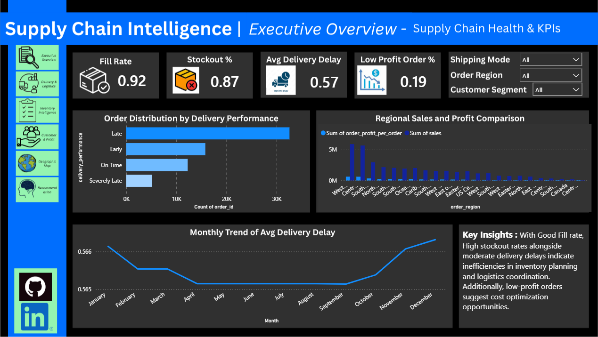

# 📊 Supply Chain Intelligence Dashboard

## 📌 Overview
This project analyzes supply chain performance to identify inefficiencies in delivery, inventory management, and profitability. The objective is to generate actionable insights and support data-driven decision-making.

---

## 🛠 Tools & Technologies
- Python (Pandas, NumPy)
- Excel
- Power BI

---

## 🔄 Project Workflow
Data Cleaning → Feature Engineering → Dashboard Development → Insights → Recommendations  

---

## 📊 Key KPIs
- **Fill Rate** – Measures demand fulfillment efficiency  
- **Stockout %** – Indicates inventory shortages  
- **Average Delivery Delay** – Measures logistics performance  
- **Low Profit Orders %** – Identifies margin inefficiencies  

---

## 🔍 Key Insights
- High stockout percentage indicates inefficiencies in inventory planning  
- Delivery delays are higher in standard shipping  
- Revenue is primarily driven by regular orders rather than high-value orders  
- Certain regions show consistent logistics inefficiencies  
- A portion of orders generate low profit  

---

## 💡 Recommendations
- Improve inventory forecasting to reduce stockouts  
- Optimize logistics routes and shipping methods  
- Reduce low-margin orders through pricing and cost control  
- Prioritize high-value customers with better service levels  
- Strengthen operations in high-demand regions  

---

## 📊 Dashboard Preview

## 📊 Dashboard Preview

<table>
  <tr>
    <td width="50%">
      
<b>Executive_Overview</b>

      
    </td>
    <td width="50%">
      
<b>Inventory_Intelligence</b>

      
    </td>
  </tr>
</table>

---

---

## 📁 Repository Structure
